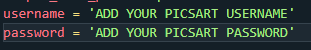

HEY THIS IS DIZZY

TO MAKE SURE THIS PROMO WORKS YOU NEED TO ADD SOME DETAILS

AND THEN RUN

IF YOU WANT THAT THE CHROME SHOULD RUN IN BACKGROUND

add - "chrome_options.add_arguement('--headless')"
on line number 37 in main.py

THANKX

run command - `python main.py`